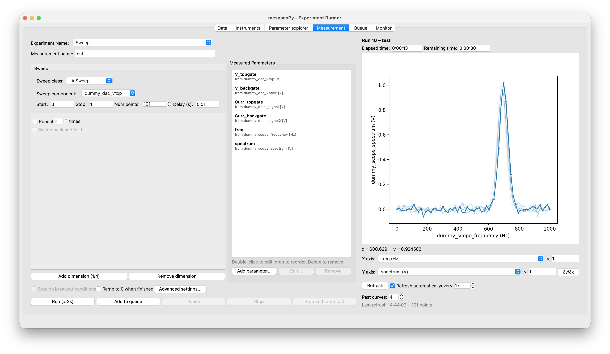

mesoscopy - Experiment Runner for mesoscopic physics
====================================================

|DOCS| |python versions| |qcodes|

Mesoscopy is a graphical user interface to run experiments in mesoscopic physics. It runs with QCoDeS as a backend.
To install and learn how to use, read `the quick overview <https://mpilde.github.io/mesoscopy/quickstart.html>`__.

Features
--------

- Set up sweeps of one or more parameters (``LinSweep``, ``LogSweep``, ``TogetherSweep``), with live plots of the data as it is acquired.
- Safe limits and maximum ramp rates for every parameter, and a safe shutdown when you stop or close the program.
- A queue of measurements, waits and series, resumable after a crash.
- A monitor with alarms and a persistent log, and an explorer of the runs of your databases.
- All data goes to standard QCoDeS databases.

Install
=======

Refer to `our documentation <https://mpilde.github.io/mesoscopy/installation.html>`__ for installation.

Documentation
=============

Read it `here <https://mpilde.github.io/mesoscopy/>`__.
Documentation is built on every push, and deployed on every successful build of ``main``.
We use sphinx for the documentation. To build the documentation locally, make sure that you have the extra dependencies required:

.. code:: bash

   pip install -r docs_requirements.txt

The screenshots of the documentation are made from the program itself (the program must be installed). Go to the directory
``docs`` and type:

.. code:: bash

   make screenshots
   make html

``make screenshots`` takes about five minutes; it is done again by the workflow on every build. The pages are generated in
``docs/_build/html``.

Contributing
============

As mesoscoPy is still a project in its infancy, we have no strict rules for contribution. However, please make sure you test your code before pushing to the ``main`` branch.

Tests
=====

The tests run without a screen, on simulated instruments:

.. code:: bash

   pip install ".[test]"
   pytest

They also run on every push (``.github/workflows/tests.yml``).

License
=======

See `License <https://github.com/condmatphys/mesoscoPy/tree/master/LICENSE>`__.

.. |python versions| image:: https://img.shields.io/badge/python-3.14%2B-blue.svg
.. |qcodes| image:: https://img.shields.io/badge/qcodes-0.60.0%2B-orange.svg
   :target: https://microsoft.github.io/Qcodes/
.. |DOCS| image:: https://img.shields.io/badge/read%20-thedocs-ff66b4.svg
   :target: https://mpilde.github.io/mesoscopy/