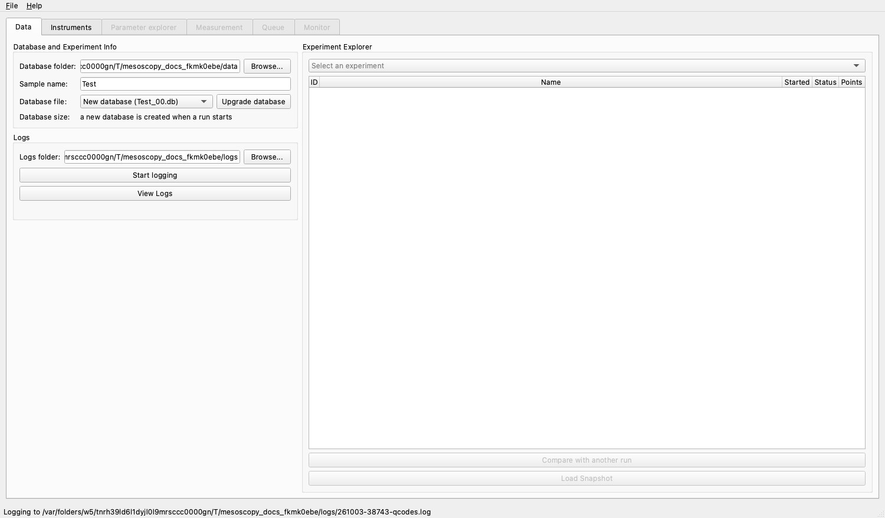
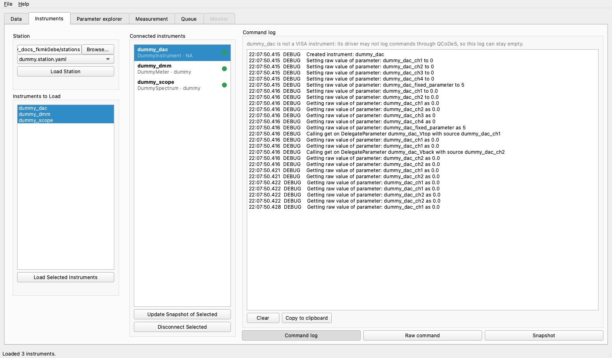
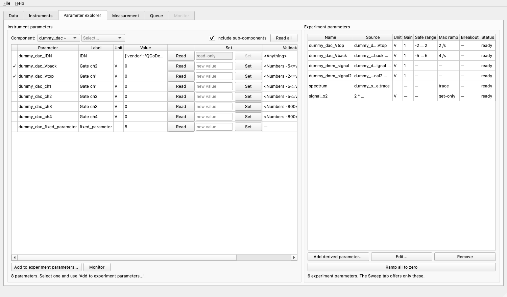
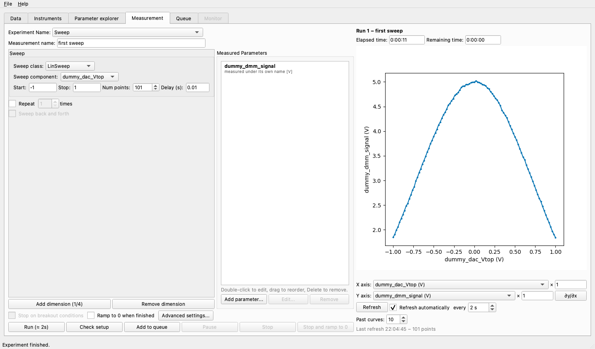
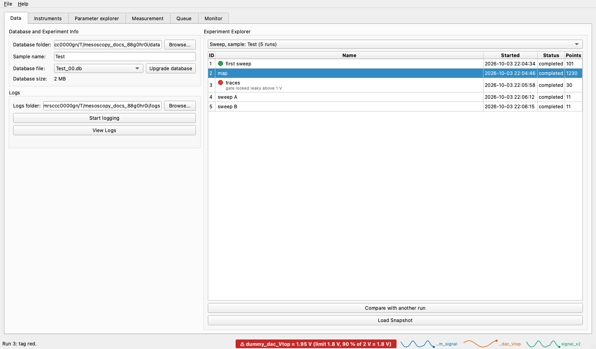

.. _quickstart:

Quick overview
==============

This page takes you from a fresh installation to a first measurement in a few minutes. It uses simulated instruments, so you
do not need any hardware. Every step names the tab and the buttons you use; the later pages of this documentation describe
each tab in detail.

.. contents:: On this page
   :local:
   :depth: 1

What mesoscoPy does
-------------------

mesoscoPy is a graphical program to run electron-transport experiments. You describe your instruments in a *station file*,
choose which of their parameters you want to sweep and measure, and run the measurement. The data is written to
`QCoDeS <https://microsoft.github.io/Qcodes/>`_ databases, and you follow the measurement live in a plot.

Before getting started, we recommend familiarizing yourself with
'QCoDeS <https://microsoft.github.io/Qcodes/examples/basic_examples/15_minutes_to_QCoDeS.html>'. You will need to know of
QCoDeS Instruments, Parameters, Station, Measurements and Databases.

Start the program
-----------------

Install mesoscoPy (see :doc:`installation`), activate its environment and type:

.. code:: bash

   mesoscopy

The window has six tabs, from left to right in the order you use them:

====================== ======================================================================================
Tab                    What it is for
====================== ======================================================================================
**Data**               where the data goes (database folder, sample name, logs) and the explorer of past runs
**Instruments**        load a station file and connect the instruments
**Parameter explorer** browse the parameters of the instruments and choose the *experiment parameters*
**Measurement**        set up a sweep, run it and watch the live plot
**Queue**              run several measurements one after the other
**Monitor**            watch parameters over time (a temperature, a field ...), with alarms
====================== ======================================================================================

A tab is greyed out until what it needs is there: Instruments needs a database, and the next tabs need loaded instruments.
Hover over a greyed tab to read what is missing.

Try it without hardware
-----------------------

Download :download:`dummy.station.yaml <_static/dummy.station.yaml>` (a station of simulated instruments) and put it in a
folder of its own, for instance ``Documents/mesoscopy/stations``. Create another folder for the data, for instance
``Documents/mesoscopy/data``.

1. Data tab: say where the data goes
^^^^^^^^^^^^^^^^^^^^^^^^^^^^^^^^^^^^

Under *Database and Experiment Info*:

- click **Browse...** next to *Database folder* and choose your data folder;
- type a *Sample name*, for example ``Test``.

The database is named after the sample: the first one is ``Test_00.db``, created when the first measurement starts. (When a
database grows above 750 MB, the next measurement starts ``Test_01.db``.) You never type a database name.

Optionally, choose a *Logs folder* and press **Start logging** to keep the QCoDeS log file there; the Monitor also writes
its log in that folder.

2. Instruments tab: load the station
^^^^^^^^^^^^^^^^^^^^^^^^^^^^^^^^^^^^

Under *Station*, click **Browse...** and choose the folder that holds ``dummy.station.yaml``. Select the file and click
**Load Station**: this only reads the file. The instruments it describes appear under *Instruments to Load*.

Select all three (``dummy_dac``, ``dummy_dmm``, ``dummy_scope``) and click **Load Selected Instruments**. They move to
*Connected instruments*, each with a coloured dot that shows whether it answers.

3. Parameter explorer tab: the experiment parameters
^^^^^^^^^^^^^^^^^^^^^^^^^^^^^^^^^^^^^^^^^^^^^^^^^^^^

The left box, *Instrument parameters*, lists every parameter of the instrument you pick in *Component*, with its value,
and lets you **Read** and **Set** it.

The right box, *Experiment parameters*, is the list of parameters you work with from now on. An experiment parameter has a
name of your choice, an optional gain, **safe limits** and a **maximum ramp rate**; a sweep can never go beyond its limits
and always moves at its ramp rate. The aliases written in the station file are already there:

- ``dummy_dac_Vtop`` and ``dummy_dac_Vback``: the two gates, limited to ±2 V and ±5 V;
- ``dummy_dmm_signal`` and ``dummy_dmm_signal2``: two readings that follow the gates.

To make another instrument parameter an experiment parameter, select it on the left and click **Add to experiment
parameters...**. **Add derived parameter...** makes a computed one, such as a density, from other experiment parameters.

.. note::

   Set the safe limits and the ramp rates of the gates **before** you connect a real sample. They are what protects it.

4. Measurement tab: sweep and measure
^^^^^^^^^^^^^^^^^^^^^^^^^^^^^^^^^^^^^

- Give the measurement a *Measurement name*, for example ``first sweep``: the **Run** button stays disabled until it has
  one. *Experiment Name* groups related measurements in the database; if you leave it empty the experiment is called ``Sweep``.
- In the *Sweep* box leave the class on **LinSweep**, choose ``dummy_dac_Vtop`` as the *Sweep component*, and enter
  *Start* ``-1``, *Stop* ``1``, *Num points* ``101`` and *Delay (s)* ``0.01`` (the time to wait at each point).
- Under *Measured Parameters* click **Add parameter...** and add ``dummy_dmm_signal``.

Click **Check setup** to see what the measurement will do before it starts: it checks the sweep against the safe limits and
reports the estimated duration without touching an instrument. Then click **Run**.

The plot on the right follows the run: the elapsed and remaining times are above it, the *X axis* and *Y axis* selectors
below let you plot any swept or measured parameter, and the faded curves are the earlier runs. You should see a peak
centred on ``Vtop = 0``.

**Pause** stops after the current point, **Stop** ends the run cleanly (what was written stays), and **Stop and ramp to 0**
also brings the swept parameters back to 0.

5. Data tab: find the run again
^^^^^^^^^^^^^^^^^^^^^^^^^^^^^^^

Back in the Data tab, the *Experiment Explorer* lists the experiments and the runs of the database. Right-click a run to
give it a colour tag or notes, to compare it with another run, or to load its snapshot.

Where to go next
----------------

- Sweeps of two or more parameters, repetitions, traces and the *Advanced settings...*: :doc:`tabs/measurement`.
- The parameters you work with, their safe limits and ramp rates: :doc:`tabs/parameter_explorer`.
- Several measurements one after the other, waits and series: :doc:`tabs/queue`.
- Watching a temperature or a field over time, and alarms: :doc:`tabs/monitor`.
- Describing your own instruments in a station file: :doc:`station_file`, and connecting them: :doc:`tabs/instruments`.
- Safe limits, ramp rates and what happens when you close the program: :doc:`program/safety`.
- Program-wide options (*File*, *Settings...*): :doc:`program/settings`.
- What the program does not do yet: :doc:`program/roadmap`.
